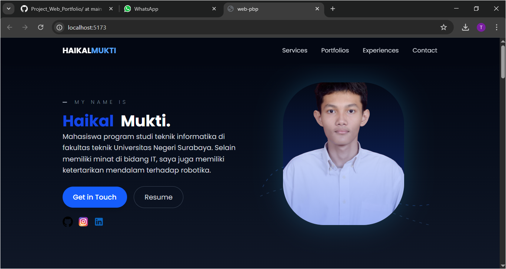
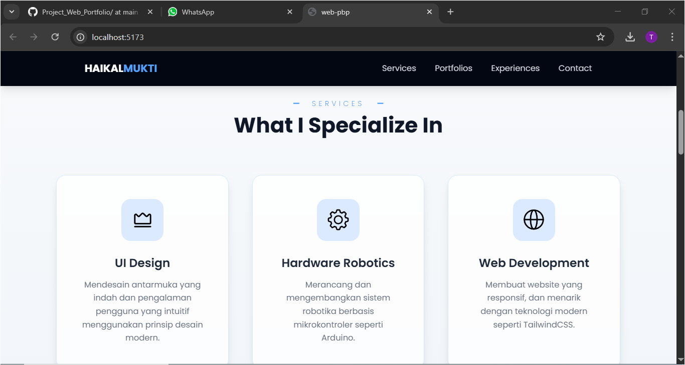
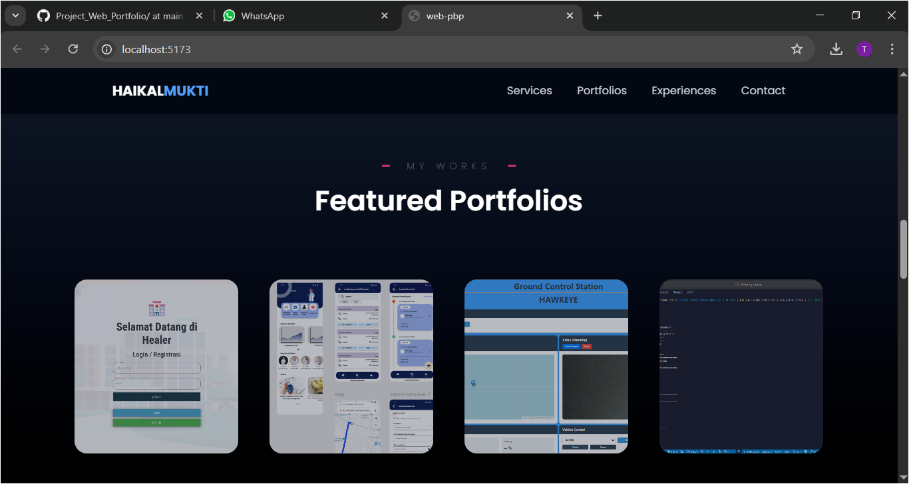
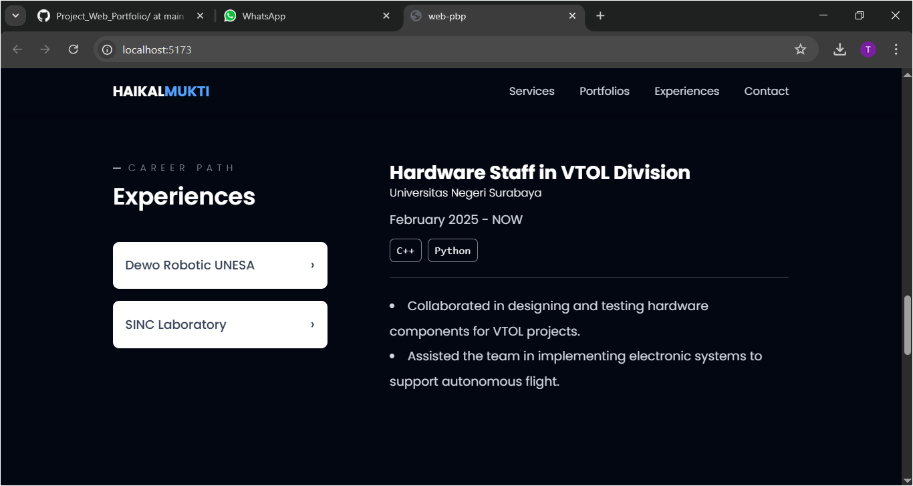
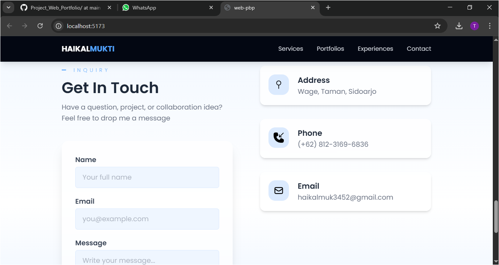
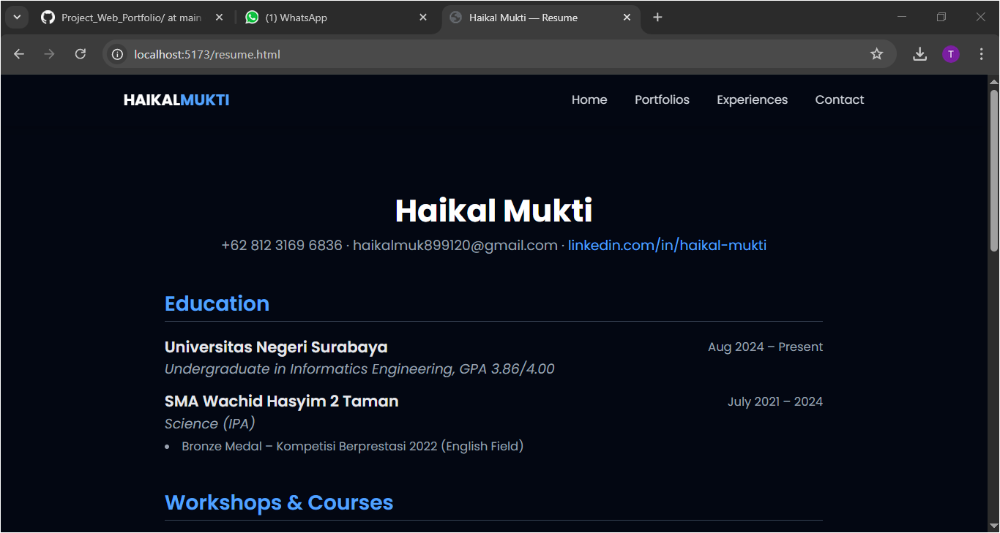
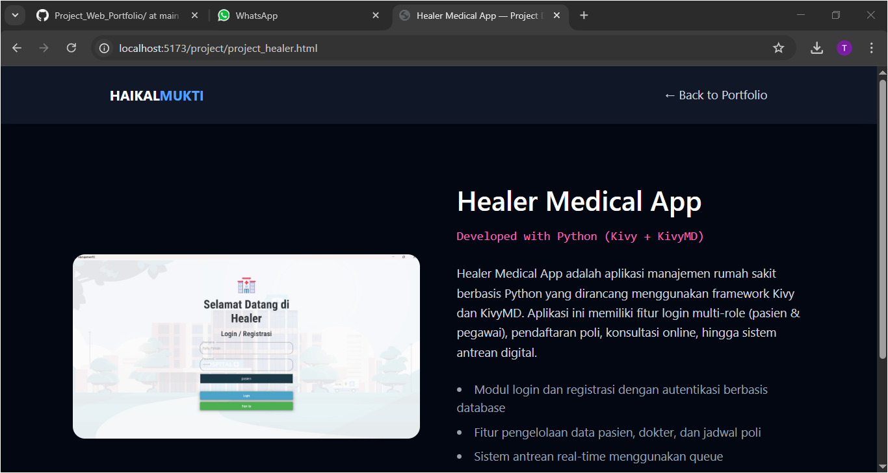
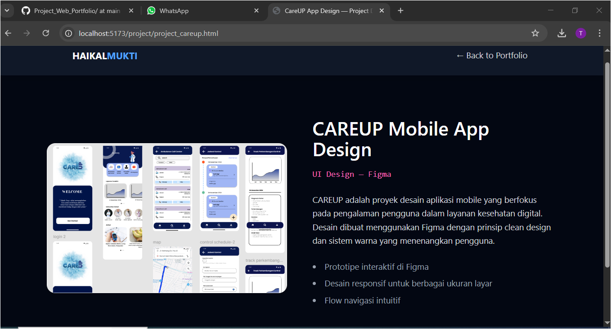
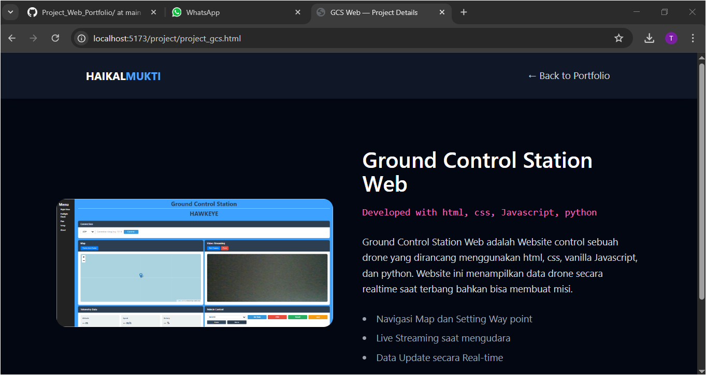
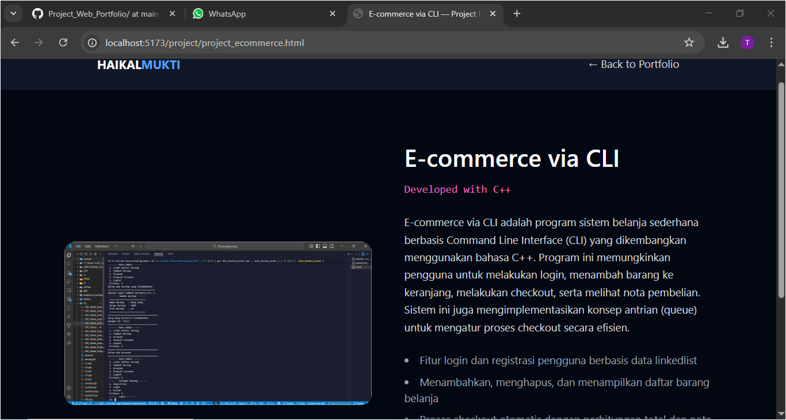

# Project Web Portfolio

**Haikal Mukti**  
NIM: 24051204065
Kelas: TI 2024B  

Website portofolio ini merupakan hasil dari proyek yang dirancang untuk memenuhi penugasan Ujian Tengah Semester mata kuliah Pemrograman Berbasis Platform, yang diampu oleh Bapak Rifqi Abdillah, S.Tr.T., M.Kom.
Proyek ini dibuat menggunakan **HTML, CSS, Javascript** dan **Tailwindcss** sebagai framework pengembangan front-end.

## Struktur Halaman

Web ini berisi 3 halaman utama:

- **Halaman 1 — Home Page**  
  Berisi pengenalan diri dan tampilan beberapa section.
- **Halaman 2 — About**  
  Menampilkan informasi pribadi, riwayat pendidikan, dan pengalaman organisasi.
- **Halaman 3 — Portfolio**  
  Berisi daftar proyek-proyek yang pernah saya buat beserta detailnya.

---

## Dibuat dengan

- **HTML** — untuk struktur halaman 
- **CSS** — sebagai styling halaman
- **Tailwind CSS using Vite** — untuk styling yang responsif dan interaktif
- **Library AOS (Animate On Scroll)** — untuk animasi transisi elemen  
- **JavaScript** — sebagai interaksi halaman  

---

## Fitur Utama

- Navbar yang responsif  
- Navigasi dengan efek animasi halus  
- Halaman portfolio dengan tampilan grid interaktif  
- Tombol *View Project* menuju halaman detail setiap proyek  

---

## Tampilan Website

